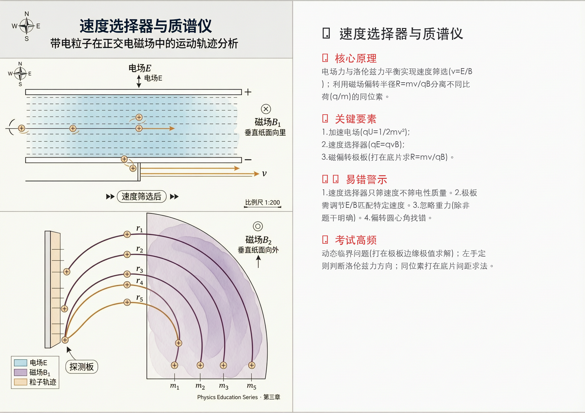
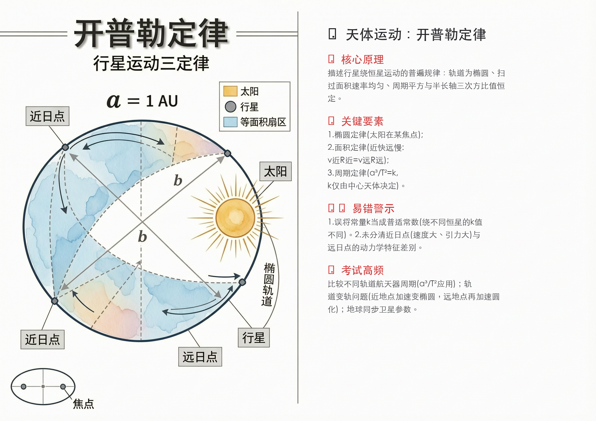
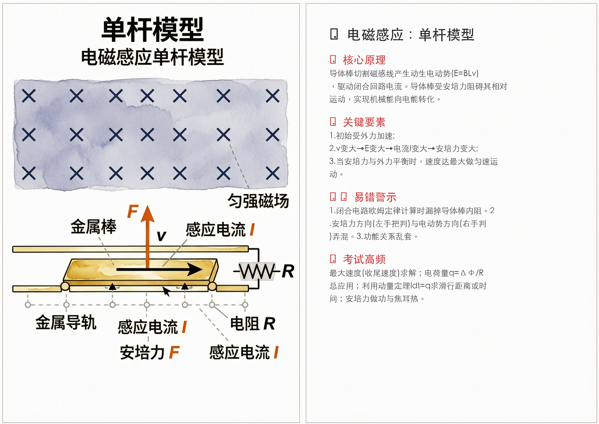
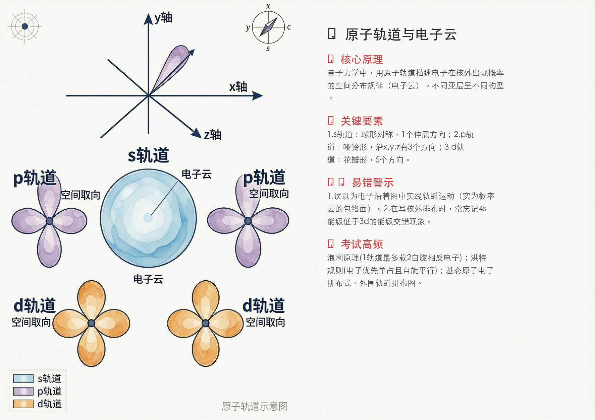
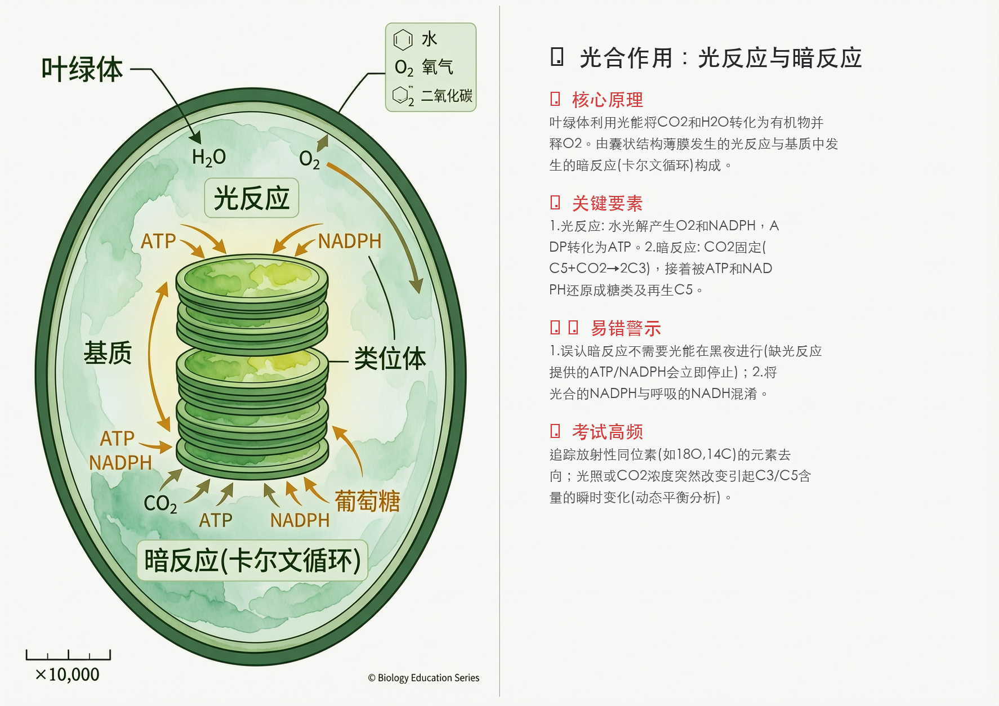
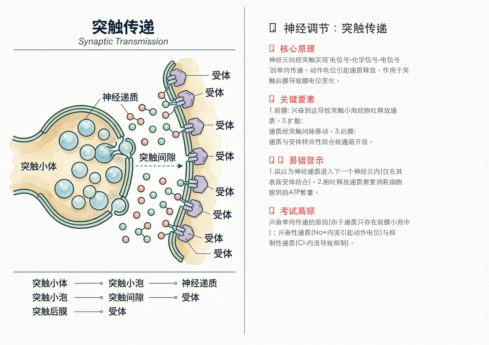
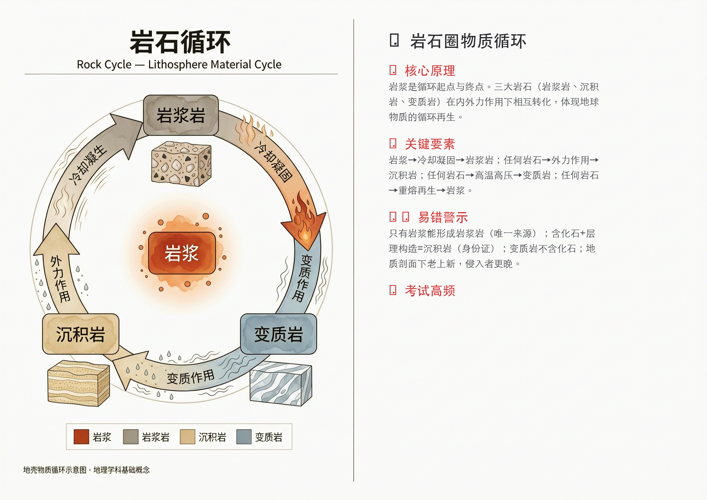
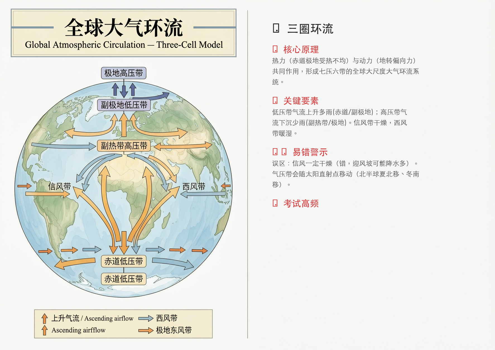

# 学霸理科图解卡片机 —— 万象 Wan 2.7 进阶应用技能 (Skill) 🧬⚡🧪

[**🇨🇳 中文**](./README.md) | [**🇬🇧 English**](./README_EN.md)

[](#)
[](LICENSE.txt)
[](#)
[](#)
[](#)

> **什么是 Skill？** 本项目不仅仅是一段生图代码，而是一套将 **Wan 2.7 大模型** 的原生影像生成能力进行“产品化封装”的独立功能模块（Prompt 提示词栈 + 自动化流）。我们将复杂的提示词工程和图像排版黑盒化，封装成了随取随用的**「技能包」**。

**核心应用场景：自动生成理化生“考点回顾卡片”**
当您的 AI 助手或后台系统挂载了本 Skill 后：不仅能直接调度 Wan 2.7 画出极具空间感的科学图解模型，还能自动预留留白、提取核心考点与易错警示进行排版。最终输出的是一张可以直接打印或投屏的**A4画幅「图文一体化教科书级讲义」**。

支持 **涵盖小学科普启蒙、中高考重难点，直至大学核心专业的自然科学全学科**。

---

## 📂 项目目录结构

```text
📦 science-graphic-tutor
 ┣ 📂 assets                  # 存放自动生成的精美图解案例
 ┣ 📂 skills                  
 ┃ ┗ 📂 wan2.7-image-skill
 ┃   ┣ 📜 SKILL_Science_Graphic_Cards.md      # [核心] AI Agent 人设与运行规则 (中文)
 ┃   ┣ 📜 SKILL_Science_Graphic_Cards_EN.md   # [核心] AI Agent 人设与运行规则 (英文)
 ┃   ┣ 📂 scripts                             # [核心] Python 原生自动生成脚本
 ┃   ┃ ┗ 📜 image-generation-editing.py
 ┃   ┗ 📂 references                          # 开发测试过程存档
 ┣ 📜 README.md               # 中文说明
 ┣ 📜 README_EN.md            # 英文说明
 ┗ 📜 LICENSE.txt             # 开源协议
```

---

## ✨ 核心亮点

- 🎨 **极致绘图质量**：得益于 Wan 2.7 卓越的模型底座，生成的科学图解逻辑精准、结构清晰，绝非普通的大模型“光影乱炖”。
- 🧠 **考点高度提炼**：拒绝大段枯燥文字，所有输出经过严格筛选，仅保留【核心原理】、【关键步骤】与经实战检验的【易错警示】，专治“看懂图但不会做题”。
- 🖨️ **图文黄金排版**：预装指令控制出图呈现 16:9 或 A4 横版比例，强制左侧 55% 画面留给插图，右侧 45% 留白用于知识点叠写，随时可用作课堂投屏或学生考前速记。

---

## 🖼️ 生成案例实测展示 (全学科矩阵)

为了验证本工作流的实战能力，我们在理化生各个维度的至难考点中进行了自动化生成测试：

### ⚡ 物理学科
涉及场论、力学机制、电磁学动量等需要极强空间建构能力的知识域：
- **[复合场运动] 速度选择器与质谱仪**：直观展示电磁平衡筛选极板与磁偏转半径实验。
   
- **[天体力学] 开普勒三大定律**：用椭圆轨道再现近快远慢与焦点占位的宏大宇宙定律。
   
- **[电磁感应] 单杆模型**：安培力、感应电动势、速度衰增一目了然的动态过程宏观呈现。
   
- **[运动学] 平抛运动**：将矢量分解附着于抛物线轨迹。
   

### 🧪 化学学科
从微观粒子轨道到底层电化学机制、再到复杂空间有机合成：
- **[物质结构] 原子轨道与电子云**：极其科幻的三维 s/p/d 轨道包络面与电子概率云展示。
   
- **[有机机理] SN2 亲核取代反应**：完美的瓦尔登翻转(雨伞翻转)及背侧立体进攻轨迹。
   
- **[电化学] 原电池与电解池**：通过双池串联，彻底根治电子绝不入水、唯见离子定向移动的痛点。
   

### 🧬 生物学科 / 地理科学
主攻微观结构与极其复杂的循环动态生理机制：
- **[经典启蒙] 动植物细胞三维对比**：细胞壁与大液泡带来的坚硬包络结构形态差异，直击眼球。
   
- **[代谢图谱] 光合作用**：类囊体里的光反应与基质中的暗反应解耦呈现。
   
- **[遗传分子] 基因表达(转录与翻译)**：从解旋的DNA、合成的mRNA穿出核孔、再到 tRNA 的流水线接力。
   
- **[神经调节] 突触传递机理**：重现电信号通过钙离子通道引发胞吐释放并开启配体通道的魔法瞬间。
   
- **[地球科学] 岩石圈物质循环**：岩浆岩、沉积岩、变质岩与内源岩浆的三进三出循环机制图谱。
   
- **[大气科学] 三圈环流**：通过地球剖面三段环流深刻理解七压六带的热力动力学实质。
   

---

## 🚀 如何使用 (部署指南)

本技能的部署形态极速、解耦。我们首推结合最前沿的底层桌面代理（如 OpenClaw / Claude Code）来进行极客式调用。

### 方案 A：在底层桌面端 Agent 中使用（OpenClaw / Claude Code 等）【⭐首推】
如果您正在使用具备 MCP (Model Context Protocol) 协议或本地沙盒控制权的强大 AI 编码助手，您**全程不需要自己手敲代码**。

直接复制以下整段话发给您的小龙虾 (OpenClaw) 或 Claude Code，让 AI 代替您完成全部部署和生成：

> 🗣️ 您只需要把这段话发给 AI：  
> "你好！请你帮我准备并运行理科图解卡片机技能。请**你自己在终端执行**以下操作：
> 1. 执行 `git clone https://github.com/kamimi8660/science-graphic-tutor.git` 将仓库克隆到当前目录，然后 `cd` 进去。
> 2. 检查安装环境：执行 `pip install dashscope pillow` 确保依赖合法。
> 3. 将环境变量临时设置为 `export DASHSCOPE_API_KEY="您的阿里云百炼_API_KEY"`（请注意替换我这句真实的Key，并且不要写入任何文件）。
> 4. 静默读取 `skills/wan2.7-image-skill/SKILL_Science_Graphic_Cards.md` 这个 Markdown 文件的全部内容，并在心里默默把它作为你接下来的工作人设和操作 SOP（不准篡改规则）。
> 5. 最后，根据你学到的卡片机规则，帮我生成一张高三物理《回旋加速器》的高频考点教学图。请你自己调用这个目录下的原生画图脚本完成出图，把成品图保存在当前文件夹给我。"

*(这些高级 Agent 只要接过上面这行提示词，就会自己像个真正的程序员一样克隆代码、装依赖、设环境变量、看您的文档规则、搜索考点并把图给您甩出来！)*

---

### 方案 B：在 Agent 开发平台免代码部署（非程序员选项）
1. **创建智能体**：打开 [Coze / 扣子](https://www.coze.cn/) 或 Dify 创建一个新的 Agent。
2. **植入大脑**：打开仓库中的 `skills/wan2.7-image-skill/SKILL_Science_Graphic_Cards.md`，复制全部内容，直接粘贴为主体的「人设与回复逻辑（System Prompt）」。
3. **配置插件（Plugins）**：必选挂载「搜索引擎插件」与「Wan2.7 图像生成插件」。
4. **填入密钥**：在平台的插件授权设置中填写 API Key。

### 方案 C：本地传统命令行硬编码调用
对于希望将其集成到现有开发体系的技术人员：
```bash
# 1. 必须优先安装运行依赖！
pip install dashscope pillow

# 2. 填入 API 密钥
export DASHSCOPE_API_KEY="您的百炼_API_KEY"

# 3. 执行原生生图挂载脚本
python3 skills/wan2.7-image-skill/scripts/image-generation-editing.py \
  --user_requirement "Scientific textbook illustration of Projectile Motion. Diagram showing an object thrown horizontally..." \
  --size "1774*1254"
```

---

## 🤝 参与贡献与支持 (Support)

如果这个自动化工作流真的帮到了您（或您的学生），给这个库点个 **⭐ Star** 将是我持续维护它的最大动力！

**如有合作需求或遇到使用问题：**
- 欢迎直接在 [Issues](https://github.com/kamimi8660/science-graphic-tutor/issues) 提出疑问。
- 欢迎提交 PR 为支持更多学科维度贡献力量。
