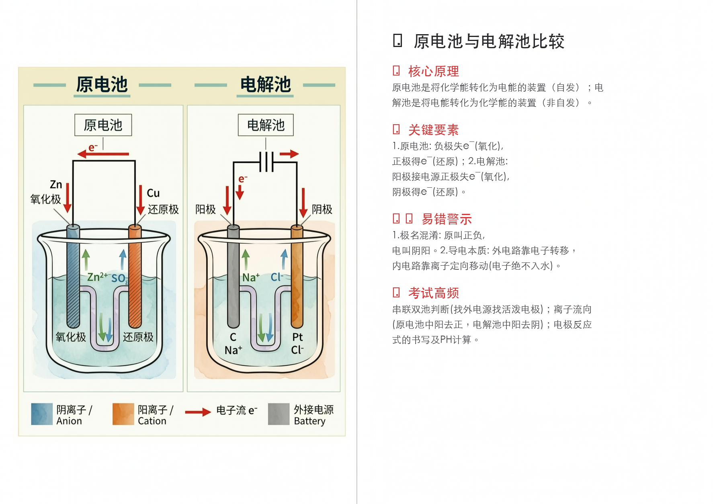
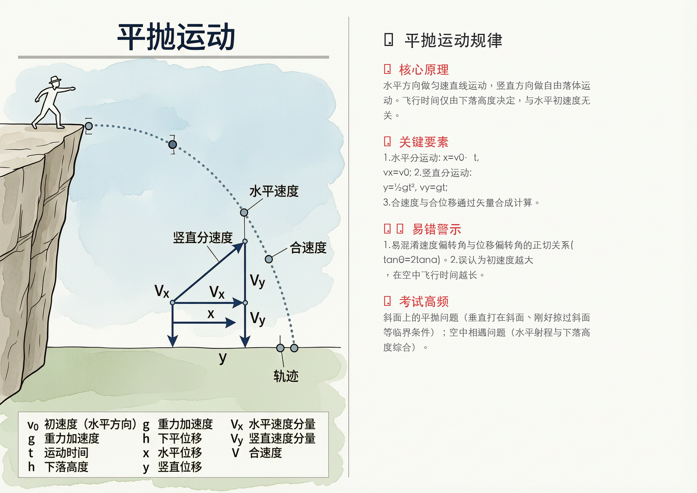
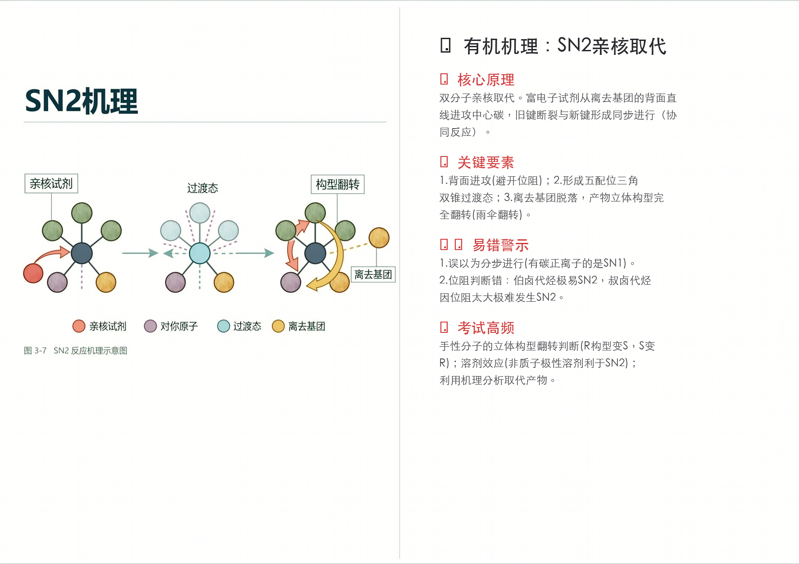
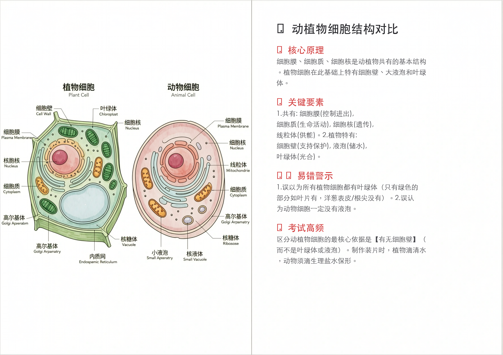

# 学霸理科图解卡片机 (Science Graphic Tutor) 🧬⚡🧪

这是一个基于 [Wan 2.7](https://github.com/Wan-Video/Wan2.1) 构建的自动化 AI 教学辅助工作流。

只需输入一个极其抽象难懂的理科知识点，AI 就能自动联网搜索验证，并生成一幅**「教科书级科学图解 + 左侧配图右侧留白排版文字」**的 A4 打印级教学卡片，实现理科知识点的空间与视觉降维打击。

支持 **涵盖小学自然科普、初高中中高考核心考点，直至大学专业的理化学科**。

---

## ✨ 核心亮点

- 🎨 **极致绘图质量**：得益于 Wan 2.7 卓越的模型底座，生成的科学图解逻辑精准、结构清晰，绝非普通的大模型“光影乱炖”。
- 🧠 **考点高度提炼**：拒绝大段枯燥文字，所有输出经过严格筛选，仅保留【核心原理】、【关键步骤】与经实战检验的【易错警示】，专治“看懂图但不会做题”。
- 🖨️ **图文黄金排版**：预装指令控制出图呈现 16:9 或 A4 横版比例，强制左侧 55% 画面留给插图，右侧 45% 留白用于知识点叠写，随时可用作课堂投屏或学生考前速记。

---

## 🖼️ 生成案例实测展示

我们在各个学段和学科中摘取了一些最难的“硬骨头”知识点进行了自动化生成测试，效果如下：

### 1. 高中化学选修 —— 原电池与电解池（双池串联模型）
把电子的流动过程和离子的迁移方向用最直观的双池模式拆解，治愈电化学懵逼症。


### 2. 高中物理必修 —— 平抛运动规律
将物理的速度矢量分解与抛物轨迹具象化，直接标注在空中拦截点上。


### 3. 大学有机化学 —— SN2 亲核取代反应机理
三维空间中展示亲核试剂的背面进攻以及由于过渡态带来的立体构型“雨伞翻转”(Walden Inversion)。


### 4. 初中生物启蒙 —— 动植物细胞结构对比
使用三维切面模型对比展示生物体内最小生命单位的区别，初中生也能秒懂液泡与细胞壁对细胞硬度的影响。


---

## 🚀 如何使用 (部署指南)

本技能完全解耦，既可以在主流 AI Agent 平台（如 Coze、Dify）一键配置成在线机器人，也可以结合本地脚本运行。

### 方案 A：在 Agent 开发平台免代码部署（推荐）
1. **创建智能体**：在 [Coze / 扣子](https://www.coze.cn/) 或 Dify 中创建一个新的 Agent。
2. **植入大脑**：打开仓库中的 `skills/wan2.7-image-skill/SKILL_Science_Graphic_Cards.md` 文件，复制全部内容，粘贴到 Agent 的「人设与回复逻辑（System Prompt）」中。
3. **配置插件（Plugins）**：
   - 必选挂载：**搜索引擎插件**（用于核对理科考点的准确性）。
   - 必选挂载：**图像生成插件**（必须支持/配置为阿里云百炼上的 Wan 2.7 API接口以保证画图效果）。
4. **填入密钥**：在平台的插件授权设置中填写您的 API Key 即可安全调用（无需把 Key 写在代码或提示词里）。

### 方案 B：本地命令行调用
如果您想将工作流集成到自己的后台系统中：
本仓库由于是 Fork 自 Wan-skills，您仍可以使用原生的图片生成脚本：
```bash
# 1. 临时设置您的安全密钥（绝不要将其写入代码提交！）
export DASHSCOPE_API_KEY="您的百炼_API_KEY"

# 2. 调用核心画图脚本并送入卡片机 Prompt
python3 skills/wan2.7-image-skill/scripts/image-generation-editing.py \
  --user_requirement "Scientific textbook illustration of Projectile Motion. Diagram showing an object thrown horizontally..." \
  --size "1774*1254"
```
